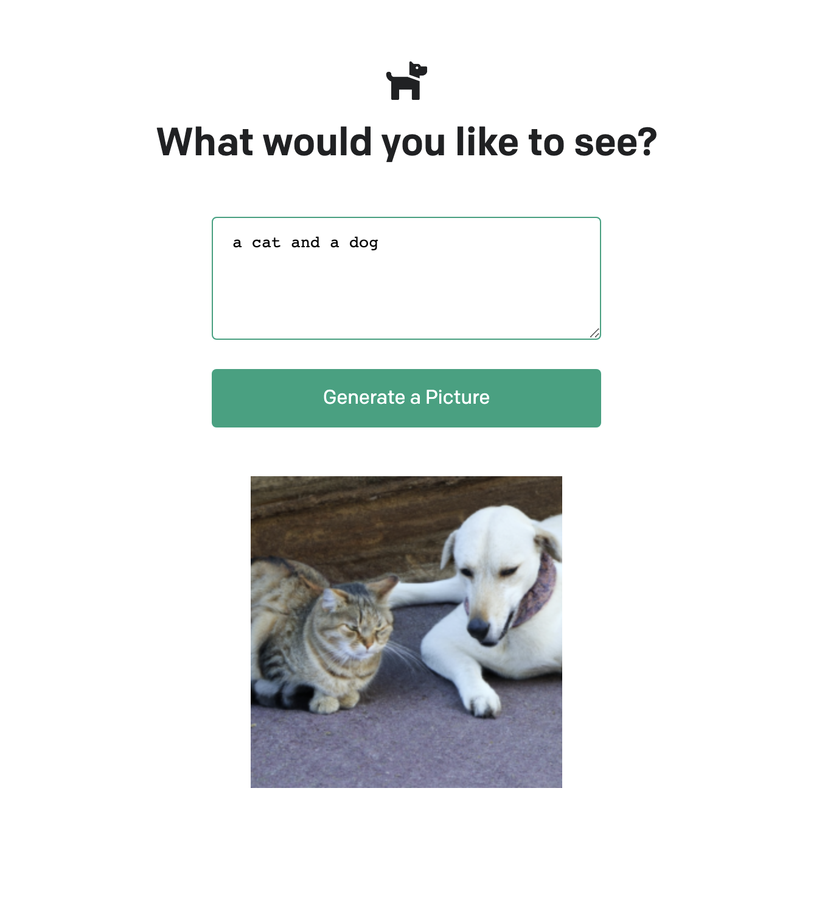

# ChatGPT Image Generator
This is a sample NodeJS application for generating images. The user is prompted to write a simple description, which the application will use to generate a corresponding image. 



The generation is provided using OpenAI's [ChatGPT API](https://openai.com/api/).

## Prerequisites
To get started you will need:
- [Docker](https://docs.docker.com/install/) installed on your local machine.
- [Node](https://nodejs.org/en/), version v16.16 or later.
- [NPM](https://www.npmjs.com/) package manager, version 8.11 or later.
- An IDE for building the application such as [Visual Studio](https://visualstudio.microsoft.com/)
- An [account with OpenAI](https://beta.openai.com/signup) to use their API service. You can get a free account for personal use (with limited API calls).
- An [OpenAI API Key](https://beta.openai.com/account/api-keys) is required to access the API needed for image generation. Store it under `.env` file in the format provided under `.env.example` (assigned under `OPENAI_API_KEY` variable)

## Running Locally (using npm)

To get started, first install dependencies:

```sh
npm i
```

Then, start the application:

```sh
npm run start
```

## Running Locally (using docker build)

You can build your own Docker image as provided below. Since node provide multiarch option, we use `buildx` to build architectures available for `node` container image. You may choose to build an individual arch otherwise.

```sh
docker buildx build --push --platform linux/arm64/v8,linux/amd64 --tag {your image name}:{your tag} .
```

You can now run the built image using the following command:

```sh
docker run -p 3000:3000 --env-file ./.env {your image name}:{your tag}
```

You will then be able to access the application on your browser under the following URL: `http://localhost:3000`

## Running Locally (using public image)

The image already exists publicly in DockerHub:

```sh
docker run -p 3000:3000 --env-file ./.env youngjeong46/chatgpt-image-generator:alpine
```

You will then be able to access the application on your browser under the following URL: `http://localhost:3000`

## Running on ECS Fargate

This is currently in progress.

<!-- The [AWS CDK](https://aws.amazon.com/cdk/) is used to deploy the application to [ECS Fargate](https://aws.amazon.com/fargate/) and is protected with [AWS WAF](https://aws.amazon.com/waf/) via the CDK for C#. Follow the instructions in the [README.md](CdkGeoLocationApi/README.md).

Alternatively, you can use the [Docker Compose for Amazon ECS](https://docs.docker.com/cloud/ecs-integration/) integration to launch the application to ECS Fargate by using the Docker CLI. You can look at [docker-compose-ecs-demo.yml](docker-compose-ecs-demo.yml) to see a simple example. **Note:** the GeoLocationAPI project uses [OpenTelemetry](https://opentelemetry.io/) and since the Docker Compose for Amazon ECS integration currently doesn't support creating sidecars in the task definition, this simple example doesn't showcase the [aws-otel-collector](https://github.com/aws-observability/aws-otel-collector). To see that functionality, deploy with the CDK instead as mentioned above in the [README.md](CdkGeoLocationApi/README.md). -->

## Running on Kubernetes

First, you will need to generate a Base64 encoded string of your OpenAI API key:

```sh
echo -n <your API key> | base64
```

Take the output and place it in the secret data inside `kubernetes-manifests/apisecret.yaml`.

To deploy to an existing Kubernetes cluster, run the following command to apply the manifests:

```sh
kubectl apply -f kubernetes-manifests/
```

The [application.yaml](./kubernetes-manifests/application.yaml) manifest doesn't expose the service via a load balancer so in order to test do something like this:

```sh
kubectl -n chatgpt-apps port-forward svc/image-generator 3000:80 
```

You can access the application via `http://localhost:3000`.